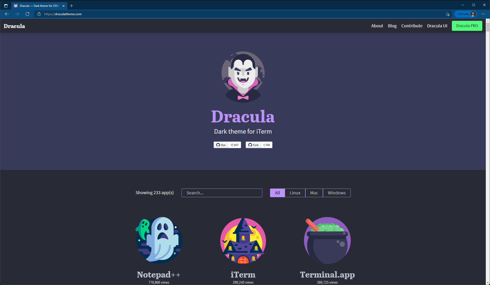

# Dracula for [Microsoft Edge](https://chrome.google.com/webstore/detail/dracula-chrome-theme-dark/gfapcejdoghpoidkfodoiiffaaibpaem)

> A dark theme for [Microsoft Edge](https://chrome.google.com/webstore/detail/dracula-chrome-theme-dark/gfapcejdoghpoidkfodoiiffaaibpaem).

## Install

All instructions can be found at [draculatheme.com/edge](https://draculatheme.com/chrome).

## Team

This theme is maintained by the following person(s) and a bunch of [awesome contributors](https://github.com/orgs/dracula/people)

 |
--- |
[Nick](https://github.com/nickimola)|

## License

[MIT License](./LICENSE)
